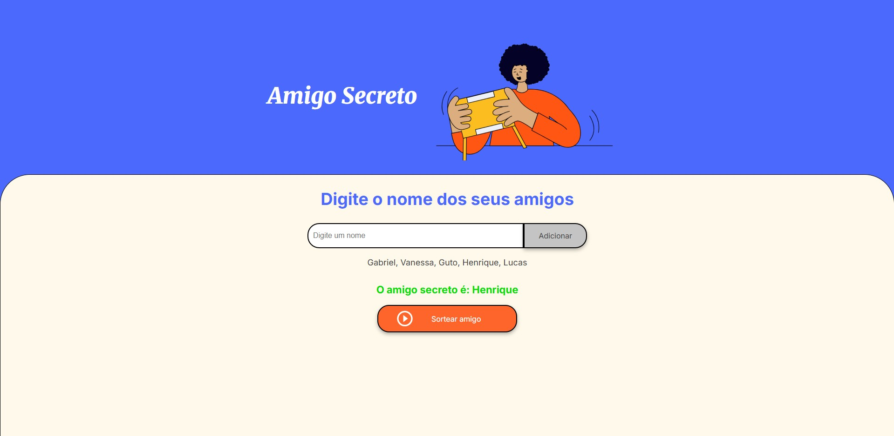

# Challenge ONE: Amigo Secreto

Este é o projeto desenvolvido para o Challenge de Lógica de Programação do programa Oracle Next Education (ONE).

## 📝 Descrição do Projeto

A aplicação "Amigo Secreto" permite que os usuários criem uma lista de participantes e realizem um sorteio para determinar quem será o amigo secreto de forma aleatória e divertida.

## ✨ Funcionalidades

-   **Adicionar Nomes:** Campo de texto para inserir os nomes dos participantes na lista.
-   **Lista de Participantes:** Exibição em tempo real dos nomes que foram adicionados.
-   **Sorteio Aleatório:** Um botão que, ao ser clicado, seleciona aleatoriamente um nome da lista e exibe o resultado.
-   **Validação de Entrada:** O sistema impede a adição de nomes em branco.

## 🛠️ Tecnologias Utilizadas

-   HTML5
-   CSS3
-   JavaScript

## 🖼️ Screenshots

## 🚀 Como Executar o Projeto

Basta abrir o arquivo `index.html` em qualquer navegador de sua preferência.

---
Desenvolvido por **Artur Soares**.